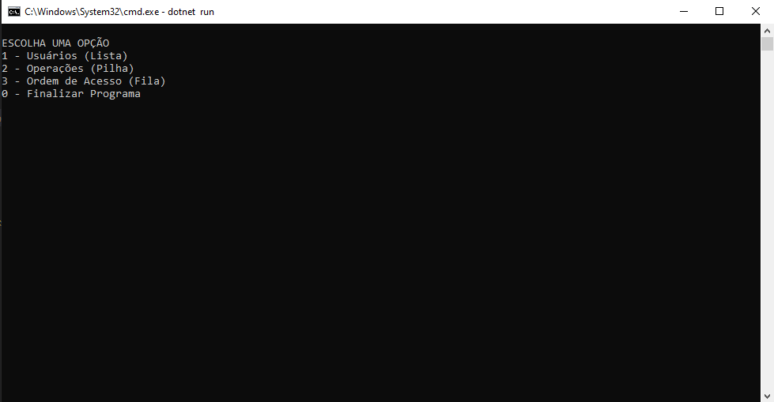

# Base-de-Dados

# Descrição
Criação de uma base de dados utilizando Lista dinâmica, fila e pilha.  
Estrutura de dados 3 Semeste Análise e desenvolvimento de sistemas.  

Funções do projeto:

Usuário (LISTA)
<ul>
  <li>Adicionar um usuário na Lista;</li>
<li>Remover um usuário na Lista pelo nome;</li>
<li>Pesquisar um usuário na Lista pelo nome e mostrar todos os dados dele;</li>
<li>Listar todos os usuários presentes na Lista;</li>
</ul>

Operação (PILHA)
<ul>
<li>Inserir uma operação na Pilha (Push);</li>
<li>Remover operação na Pilha (Pop);</li>
<li>Executar todas as operações dentro da Pilha na ordem correta (Pop até o fim da pilha);</li>
</ul>

Acesso (FILA)
<ul>
<li>Adicionar um pedido de acesso na Fila;</li>
<li>Liberar acesso para o primeiro da Fila;</li>
<li>Liberar acesso para todos da Fila (na ordem de chegada na fila);</li>
</ul>

# Layout do Projeto

  
    

# Tecnologias Utilizadas
<ul>
<li>C#</li>
<li>.net 6.0</li>
<li>Visual Studio Code</li>
</ul>

# Autores
José Ricardo Chies Gonçalves

LinkedIn: https://www.linkedin.com/in/ricardo-chies-087557216/

E-mail: chies.dev@gmail.com

Mateus Franklin Neco

LinkedIn: https://www.linkedin.com/in/mateus-franklin-3049941a2/

E-mail: matfranklin@outlook.com
